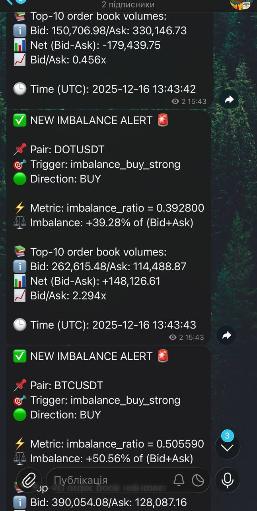

# 🌐 Мова

- 🇺🇦 [Українська](#-binancetesttracker-укр-версія)

---

# 📈 BinanceTestTracker (укр версія)

### 🔍 Моніторинг дисбалансу в книзі замовлень Binance Spot(Top-10)

**BinanceTestTracker** — асинхронний трекер, який підключається до **Binance Spot WebSocket**, читає стакан (Top-10 bids/asks), рахує **imbalance_ratio** та генерує **алерти (тригери)** з логами й опційними Telegram-пушами.

**Pipeline-архітектура**, яку легко маштабувати під реальні задачі трейдингу: нові метрики, правила входу/виходу, підтвердження сигналів, збереження історії та auto-execution.

> ⚙️ Pipeline: **Exchange WS → Parser/Normalizer → Metrics Engine → Trigger Engine → Sinks (Logs/Telegram/DB/Execution)**

---

## 🧠 Як це працює

Ми беремо:
- **10 найкращих цін на купівлю(bids)** - найближчі до поточної ціни з боку покупців  
- **10 найкращих цін на продаж(asks)** - найближчі до поточної ціни з боку продавців  

Рахуємо:

**Imbalance Ratio**


### (BidVolume - AskVolume) / (BidVolume + AskVolume)

- значення **> 0** - перевага попиту(BUY pressure)
- значення **< 0** - перевага пропозиції(SELL pressure)

---

## ✅ Фічі

- Binance Spot WS (`depth10@100ms`)
- Top-N стакан(за замовчуванням 10)
- Метрика `imbalance_ratio`:
  - `qty` - по кількості активу
  - `notional` - `price * qty`(обсяг в USD еквіваленті)
- Тригери в обох напрямках(buy/sell), з cooldown та режимом `edge`
- Логи(консоль + файли)
- Telegram нотифікації(опційно)

---

## ⚡ Швидкий старт

### 1) Встанови залежності
```bash
pip install -r requirements.txt
```

### 2) Налаштуй config/config.yaml

```
pairs: ["SOLUSDT", "BTCUSDT", "DOTUSDT"]

binance:
  ws_url: "wss://stream.binance.com:9443/stream"
  depth_stream: "depth10@100ms"
  top_n: 10

metrics:
  volume_mode: "notional"   # qty | notional

triggers:
  - name: "imbalance_buy_strong"
    metric: "imbalance_ratio"
    op: ">="
    value: 0.25
    cooldown_sec: 10
    emit: "edge"

  - name: "imbalance_sell_strong"
    metric: "imbalance_ratio"
    op: "<="
    value: -0.25
    cooldown_sec: 10
    emit: "edge"

sinks:
  - type: "logger"
    level: "INFO"
    log_metrics: true

telegram:
  enabled: true
  bot_token: "XXX"
  chat_id: "-100..."

```

### 3) Запуск

```bash
python main.py
```

# 📩 Telegram(опційно)

Увімкни:

```bash
telegram:
  enabled: true
  bot_token: "xxx"
  chat_id: "-100..."
```
Для каналу: додай бота як admin з правом постити.

# 🧾 Приклад логів

```bash
INFO  | Runner started | pairs=['SOLUSDT'] | stream=depth10@100ms
INFO  | METRIC | pair=SOLUSDT | imbalance_ratio=0.285928 | bid_vol=762596.00 ask_vol=423467.34
SUCCESS | ✅ SUCCESS | TRIGGER | pair=SOLUSDT | imbalance_buy_strong: imbalance_ratio >= 0.25 | value=0.285928 | bid=762596.00 ask=423467.34

```

# 🧱 Структура проекту

```
BinanceTestTracker
├── .gitignore
├── README.md
├── app
│   ├── __init__.py
│   ├── core
│   │   ├── __init__.py
│   │   ├── config.py
│   │   ├── gateway.py
│   │   ├── metrics.py
│   │   ├── models.py
│   │   ├── orderbook.py
│   │   ├── runner.py
│   │   ├── sinks.py
│   │   └── triggers.py
│   ├── exchanges
│   │   ├── __init__.py
│   │   └── binance
│   │       ├── __init__.py
│   │       ├── parser.py
│   │       └── ws.py
│   ├── logging_setup.py
│   └── notify
│       ├── __init__.py
│       └── telegram
│           ├── __init__.py
│           ├── messages.py
│           └── sender.py
├── config
│   └── config.yaml
├── logs
│   └── BinanceTestTracker.log
├── main.py
└── requirements.txt
```

# 🧾 Приклад вмісту сповіщення


<p align="center">
  
</p>